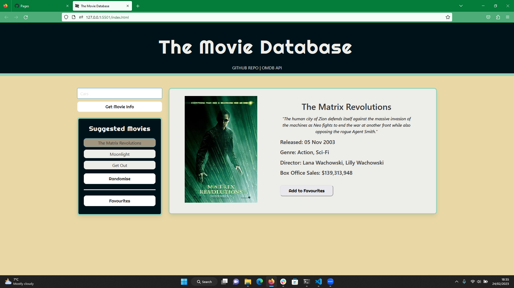

# The Movie Database
This project is a simple web application that allows users to search for movies using the OMDb API and displays the results on the page. Users can also add movies to a list of saved movies and view them later. The project was created in a group setting utilising git for version control. 

## Languages and Frameworks Used
* HTML
* CSS
* JavaScript
* jQuery
* Bootstrap

### Usage
To use this application, simply clone this repository to your computer:
* git clone git@github.com:JamesRobertSutcliffe/the-movie-database.git

Then, open the index.html file in your web browser to view the app.

### Here's how the app works:

Enter a movie title in the search bar and click the "Search" button. The app will display up to five results. Click on the poster of each movie to view more information about the movie in the middle of the page.

On the left side of the page, there are three buttons that generate random movies. Clicking the buttons will populate the movie information in the middle of the page.

To save a movie to your list of saved movies, click the "Add to Saved Movies" button. The movie will be saved to your local storage and can be accessed by clicking the "Saved Movies" button.

### Links
Here are the links to the GitHub repository and GitHub Pages for this project:

[Repository](https://github.com/JamesRobertSutcliffe/the-movie-database)

[Github Pages](https://jamesrobertsutcliffe.github.io/the-movie-database/)

### Contributing
If you would like to contribute to this project, please follow these steps:

* Fork the repository: https://github.com/your-username/your-repo-name
* Create a new branch: git checkout -b new-feature
* Make your changes and commit them: git commit -m 'Add new feature'
* Push to the branch: git push origin new-feature
* Submit a pull request

### License
This project is licensed under the MIT License - see the LICENSE.md file for details.
